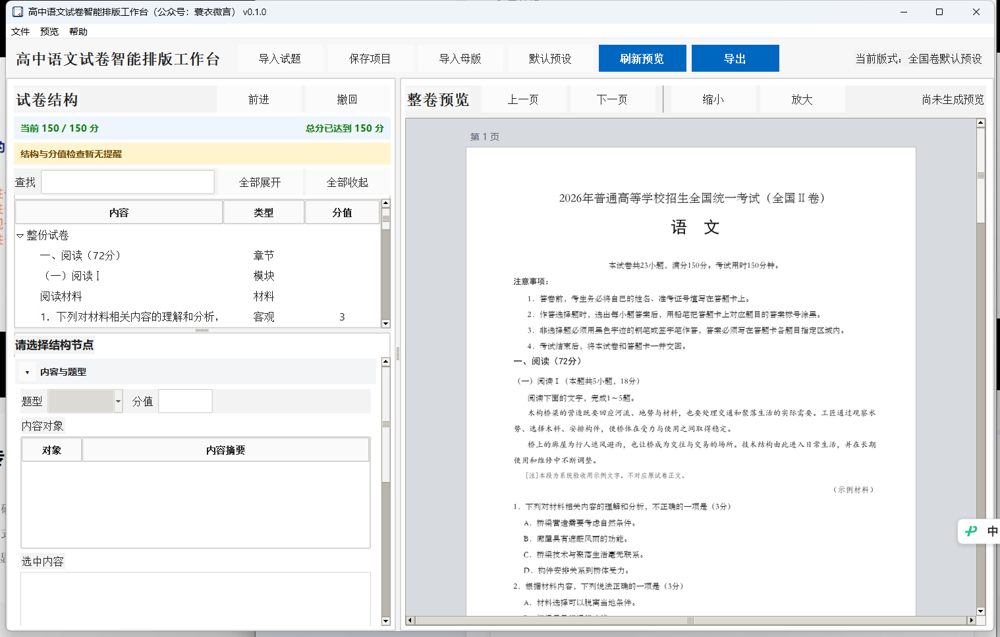

# 高中语文试卷智能排版工作台

<p align="center">
  
</p>

这是一个面向高中语文教师的 Windows 试卷排版工具。软件把已有 Word 试题识别为卷首、阅读模块、材料、题目、选择项、诗歌、作文和答案等结构，再按预设的高中语文试卷规范统一排版。

当前正式版本为 **0.1.0**。



## 软件能做什么

- 导入 `.docx` 和 `.doc` 试题，也支持把 Word 文件直接拖入窗口。
- 按预设模板识别卷首、注意事项或考生须知、阅读材料、题目、选项、作文与答案。
- 在左侧结构树中选择具体内容，修改文字、字体、字号、缩进、行距、段距和分页参数。
- 在右侧查看 A4 分页预览，并随结构选择定位到对应内容。
- 汇总各道末级题目的分值，实时显示与 150 分的差额。
- 设置目标页数，默认 8 页，并在安全范围内调整段落节奏。
- 保留原文表格、图片、下划线、加粗、着重号等 DOCX 原生内容。
- 导出新的 DOCX，文件名自动在原文件名后添加“（排版）”。

## 基本使用流程

1. 下载并运行 Windows 便携版 EXE。
2. 点击“导入试题”，或者把 Word 文件拖入软件窗口。
3. 在左侧检查试卷结构、题号和分值。
4. 选择具体题目、材料或选项，按需要调整内容与格式。
5. 在右侧检查分页预览。
6. 点击导出，保存排版后的 DOCX。

题目数量与预设模板不一致时仍可导入。题目分值允许留空，导出前软件会提醒检查，不会强制阻止导出。

## 预设排版规则

软件内置全国卷风格的高中语文排版规则，包含以下常用结构。

- 卷首标题、科目名称、试卷说明、考试时间与注意事项
- 阅读模块标题、材料一、材料二、文本一、文本二
- 文章标题、作者、注释和出处
- 客观题、主观题、翻译题、默写题和作文题
- 选择项文本之前 1.5 字符、悬挂缩进 1.7 字符
- 文言断句字母标记、诗歌分行和作文三段式字体
- 答案与评分建议的独立排版

排版识别依据文本结构和上下文，不把固定题号绑定为固定题型。

## 软件更新

菜单“帮助 → 检查更新”会直接访问本项目的 GitHub Releases。软件会自动比较版本，发现新版本后可在软件内下载 Windows EXE。用户无需填写 GitHub 地址。

更新检查只读取公开的 Release 信息，不上传试题内容。

## 下载

请在 [GitHub Releases](https://github.com/suoyikehahaha/chinese_exam_typesetter/releases/latest) 下载最新 Windows 版本。

Windows 10 和 Windows 11 可以直接运行便携版 EXE。DOCX 的读取、预览和导出不要求安装 Microsoft Office 或 WPS。导入旧版 `.doc` 时，软件会按需调用本机的 Word 或 WPS 进行转换。

## 当前范围

当前版本只处理可编辑的 Word 文档，并只导出 DOCX。PDF 导入、PDF 导出、扫描件 OCR 和复杂版面重建暂未提供。

内部预览用于排版检查。最终分页仍应以导出的 DOCX 在 Word 或 WPS 中打开后的结果为准。

## 源码运行与构建

环境要求为 Python 3.11 或更高版本。

```powershell
python windows_launcher.py
```

Windows 打包使用项目根目录中的脚本。

```powershell
powershell -ExecutionPolicy Bypass -File .\build_windows.ps1
```

自动测试命令如下。

```powershell
python -m unittest discover -s tests -q
```

## 使用许可

本软件为本人（公众号：蓑衣微言）为高中语文试题排版而做，未经本人书面许可，不得销售、出租、收费分发、嵌入商业服务或用于其他营利活动。

详细条款请阅读 [使用许可](使用许可.md)。

## 问题反馈

如遇到识别或排版问题，请在 GitHub Issues 中说明软件版本、Word 文件来源类型、出现问题的位置和预期格式。涉及真实学生信息或未公开试题时，请先进行脱敏处理。
